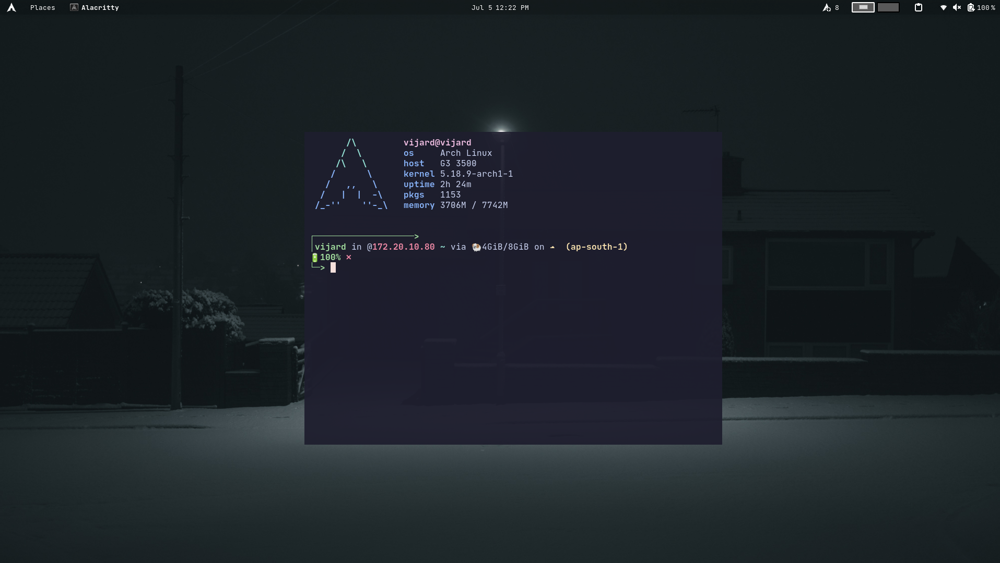

# Dotfile

These are some of my unarranged uncategorized currently using dotfiles which make me happy rn.

```sh
// copy dotfiles
sudo chmod 400 ./setup.sh
```

Ciao

System : Arch Linux
DE : Gnome
Theme: WhiteSur
Font: JetBrainsMono nerd Font
Terminal: Alacritty+Zsh+Starship


